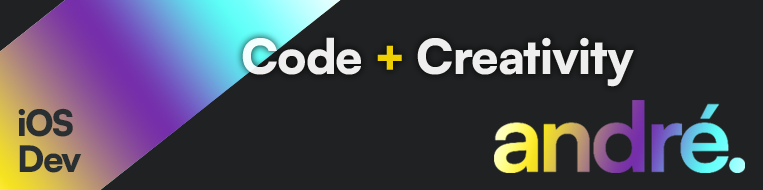

> #### Hi! My name is André Foulem. I am an iOS Developer.
>
> 

#

#

#

> ### Languages

#

> ### Dev tools

#

> ### Frameworks + Libraries

#

> ### Cloud

#

> ### Data

#

> ### Design

#

> ### Social

#

> ### **Fries** 😋 🍟

